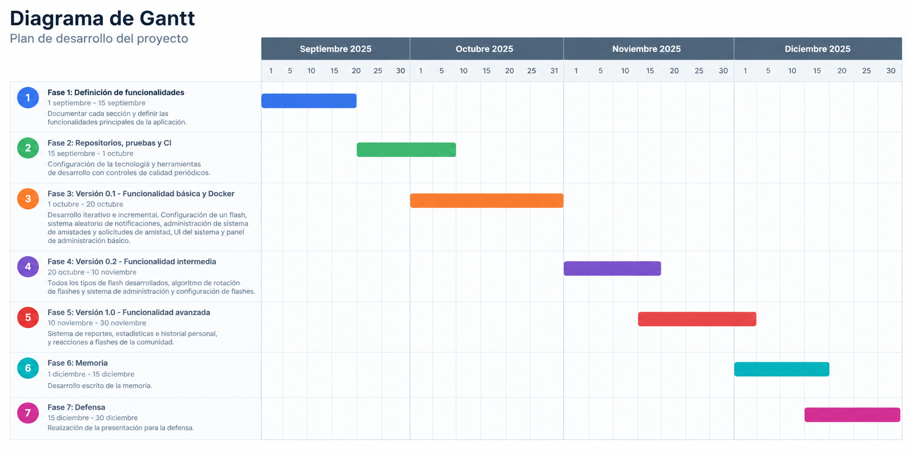

# Flashing: Una red social con cliente web y móvil de retos aleatorios. 

Flashing es una red social de retos creativos cortos ("flashes"). Cada día, en una hora específica y variable, los usuarios reciben el mismo reto ("flash") y tienen un tiempo limitado para resolverlo. Las respuestas pueden ser una foto, un audio, un dibujo o un texto corto, dependiendo del reto. Cada respuesta queda grabada en un historial personal ("memories") y es compartida con los amigos que el usuario haya agregado en la aplicación, y cada usuario no podrá ver las respuestas de su comunidad hasta que no resuelva su flash diario. Existe un administrador que puede acceder a la plataforma web para gestionar los usuarios, flashes, categorías y temporadas, además de acceder a las estadísticas de uso de la aplicación. 

*Nota: esta primera fase tiene solo definidos los objetivos técnicos y uncionales, pero no incluye aún ningún aspecto de implementación.*

## Objetivos

### Objetivos funcionales
#### Cliente móvil:
* Consultar el flash activo (recibe notificación a la hora concreta).
* Resolver el flash activo.
* Consultar su historial de flashes ("memories").
* Consultar las estadísticas personales.
* Administrar amistades.
* Configurar su perfil personal y privacidad.
* Reportar contenido.
* Reaccionar a respuestas de sus amistades.

#### Cliente web:
* Administrar flashes.
* Programar un flash.
* Administrar categorías y temporadas.
* Revisar usuarios y estadísticas.
* Moderar contenido y gestionar reportes.
* Configurar la rotación de los flashes.
* Modo demo para depuración.

### Objetivos técnicos
 * Realizar una aplicación lo más cercana a un nivel empresarial funcionando correctamente en plataformas web y móvil.
 * Realizar una aplicación segura y escalabe que pueda manejar un gran volumen de carga y usuarios.
 * Proporcionar una integración con modelos de Inteligencia Artificial.
 * Realizar todo el sistema con el menor presupuesto posible.

## Metodología

*   **Fase 1: Definición de funcionalidades:** 1 septiembre - 15 septiembre. Documentar cada sección y definir las funcionalidades principales de la aplicación.
*   **Fase 2: Repositorios, pruebas y CI:** 15 septiembre - 1 octubre. Configuracíon de la tecnología y herramientas de desarrollo con controles de calidad periódicos.
*   **Flase 3: Versión 0.1- Funcionalidad básica y Docker:** 1 octubre - 20 octubre. Desarrollo iterativo e incremental. Configuración de un flash, sistema aleatorio de notificaciones, administración de sistema de amistades y solicitudes de amistad, UI del sistema y panel de administración básico.
*   **Fase 4: Versión 0.2- Funcionalidad intermedia:** 20 octubre - 10 noviembre. Todos los tipos de flash desarrollados, algoritmo de rotación de flashes y sistema de administración y configuración de flashes.
*   **Fase 5: Versión 1.0- Funcionalidad avanzada:** 10 noviembre - 30 noviembre. Sistema de reportes, estadísticas e historial personal, y reacciones a flashes de la comunidad.
*   **Fase 6: Memoria:** 1 diciembre - 15 diciembre. Desarrollo escrito de la memoria.
*   **Fase 7: Defensa:** 15 diciembre - 30 diciembre. Realización de la presentación para la defensa.

## Funcionalidades detalladas

### Funcionalidad básica
#### Usuario no registrado
* Consultar la pantalla pública de bienvenida.
* Ver tutorial y ejemplos de funcionamiento.
* Consultar información sobre privacidad y normas de la comunidad.
* Acceso al formulario y funcionalidad de registro e inicio de sesión.
* Consultar información de contacto y soporte.

#### Usuario registrado
* Crear una cuenta.
* Iniciar sesión.
* Cerrar sesióm.
* Consultar y editar su perfil.
* Consultar el flash actual (recibir notificaciones).
* Responder al flash actual.
* Consultar su historial de respuestas.
* Eliminar su respuesta al reto actual.
* Configurar la privacidad de sus respuestas.
* Reportar contenido.
* Bloquear, añadir y eliminar usuarios como amigos.
* Eliminar su cuenta.

#### Administrador
* Iniciar sesión en la aplicación web.
* Crear, editar, activar y desactivar retos.
* Revisar y administrar usuarios y estadísticas.
* Moderar contenido.
* Programar el próximo flash.

#### Flash básico: doble fotografía instantánea
El usuario realiza dos fotografías en el momento: una con la cámara frontal y otra con la cámara trasera. Permite una repetición dentro del tiempo límite.

### Funcionalidad intermedia
#### Tipos de flashes restantes:
* **Dibujo rápido según temática:** el sistema muestra una temática y un tiempo limitado. El usuario tiene ese tiempo para realizar un pequeño boceto de lo solicitado.
* **Audio breve según temática:** el usuario graba una respuesta corta según la temática solicitada.
* **Fotografía según indicaciones:** el sistema proporciona una instrucción y el usuario debe capturar una foto que cumpla dicha instrucción en un tiempo limitado.
* **Texto breve limitado:** el usuario responde con un texto breve a lo indicado por el sistema.

El sistema deberá crear y programar de manera autónoma el flash diario en base a unas instrucciones.

La aplicación debe permitir también participar tarde, pero diferenciando claramente el resultado. Una respuesta tardía será señalada como tal y puede quedar excluida de futuras votaciones o reacciones.

La aplicación contará con un sistema de "rachas" que potenciará la fidelización de los usuarios y su participación en el flash diario.

El usuario registrado podrá consultar su historial ("memories").

Se implementarán notificaciones no solo para el flash diario, sino también para las interacciones y solicitudes de amistad.

### Funcionalidad avanzada

El sistema contará con un algoritmo de rotación de flashes. Deberá seleccionar el próximo flash y su temática en base a: retos ya utilizados, tiempo desde la última aparición de la categoría, formato utilizado recientemente, dificultad, duración, temporada, ... etc.

La Inteligencia Artificial se incluirá para proponer variantes de retos, y generar retos en base a unas instrucciones, aunque no se dependerá de esta para el funcionamiento principal de la aplicación en primeras versiones.

## Análisis
*   **Pantallas y navegación:** 
    
    *   **Esquema de pantallas:** cliente móvil. Usuario registrado y usuario anónimo.
        
        El cliente móvil contará con un esquema de pantallas cuya proporción de acceso dependerá principalmente si se ha realizado o no el flash activo. Pudiendo así visualizar el contenido del resto de los usuarios o no.

        El usuario anónimo solo podrá acceder a las 4 primeras pantallas hasta que cree una cuenta e inicie sesión en la aplicación.

     

     

     

     

      *   **Esquema de pantallas:** cliente web. Usuario administrador.

            El cliente web proporcionará al administrador acceso a las funcionalidades de control y modificación de la aplicación, así como al acceso a las estadísticas globales.

      

      

      

*   **Entidades y atributos:** 
    
    * User: 
        * id
        * username
        * displayName
        * email
        * passwordHash
        * role {USER, ADMIN}
        * avatar
        * timezone
        * createdAt
        * lastLoginAt
        * status {ACTIVE, SUSPENDED, DELETED}

    * Challenge: (plantilla reutilizable de reto)
        * id
        * title
        * prompt
        * type {DOUBLE_PHOTO, QUICK_DRAWING, SHORT_AUDIO, GUIDED_PHOTO, SHORT_TEXT}
        * category
        * difficulty {EASY, MEDIUM, HARD}
        * durationSeconds
        * active
        * season
        * createdAt
        * createdBy (para diferenciar entre los generados por IA o administrador)

    * DailyFlash: (aparición concreta de un reto en una fecha)
        * id
        * challengeId
        * scheludedAt
        * endsAt
        * status {SCHELUDED, ACTIVE, CLOSED, CANCELLED}
        * timezone
        * createdAt

    * Submision: (respuesta de un usuario)
        * id
        * dailyFlashId
        * userId
        * type
        * textContent
        * mediaUrl
        * submittedAt
        * submissionStatus {SUBMITTED, VISIBLE, REPORTED, HIDDEN, REMOVED}
        * visibility {PRIVATE, FRIENDS}
        * isLate
        * createdAt

    * MediaAsset: (representa imagen o audio)
        * id
        * submissionId
        * type
        * storageKey
        * mimeType
        * sizeBytes
        * durationSeconds
        * createdAt

    * Reaction: (reacciones a un flash)
        * id
        * submissionId
        * userId
        * reactionType {LIKE, LAUGH, WOW, DISLIKE}

    * Friendship:
        * id
        * requesterId
        * status {PENDING, ACCEPTED, CANCELLED}
        * createdAt
        * acceptedAt

    * Block: (para bloqueos entre usuarios)
        * id
        * blocker
        * blocked
    
    * Report
        * id
        * reporterId
        * reportedUserId
        * reason {HARASSMENT, HATEFUL_CONTENT, SEXUAL_CONTENT, VIOLENCE, SPAM, PRIVACY, OTHER}
        * status {PENDING, RESOLVED, DISMISSED}
        * resolution
        * createdAt
        * resolvedAt

Relaciones

* User 1 -- N Submission (un usuario puede responder a muchos flashes)
* Challenge 1 -- N DailyFlash (una plantilla puede usarse en varias fechas)
* DailyFlash 1 -- N Submission (un flash recibe muchas respuestas, aunque una por usuario como máximo)
* Submission 1 -- N MediaAsset (una doble foto necesita de dos archivos)
* Submission 1 -- N Reaction (una respuesta puede tener varias reacciones)
* User 1 -- N Reaction (un usuario puede escribir varias reacciones)
* User 1 -- N Friendship (para representar envíos de solicitudes)
* User 1 -- N Friendship (para representar solicitudes recibidas)
* User 1 -- N Block (para representar usuarios bloqueados)
* User 1 -- N Block (para representar bloqueos a un usuario)
    

*   **Permisos de usuarios:** 
    * Usuario anónimo:
        * Ver landing page.
        * Consultar explicaciones y ejemplos.
        * Consultar normas.
        * Registrarse e iniciar sesión.

    * Usuario registrado:
        * Gestionar su perfil.
        * Consultar el flash activo.
        * Responder al flash activo.
        * Consultar su historial.
        * Gestionar amistades.
        * Consultar respuestas de amistades.
        * Reaccionar a respuestas de amistades.
        * Reportar contenido.
        * Bloquear usuarios.
        * Configurar privacidad.
        * Eliminar sus datos.

    * Administrador:
        * Crear, modificar y eliminar flashes.
        * Activar y desactivar flashes.
        * Gestionar categorías.
        * Programar próximo flash.
        * Consultar, bloquear o desactivar usuarios.
        * Consultar y resolver reportes.
        * Moderar contenido.
        * Consultar gráficos globales.
        * Gestionar temporadas y retos sugeridos por IA.

*   **Imágenes:** la entidad MediaAsset representará una imagen o archivo de audio en la aplicación.
*   **Gráficos:** la aplicación contará con gráficos que muestran la participación diaria (usuarios activos, número de respuestas, porcentaje de respuestas a tiempo y porcentaje de respuestas tardías), participación por tipo de reto, popularidad de categorías, evolución de registros y usuarios activos y tiempo medio de respuesta. 
*   **Tecnología complementaria:** se hará uso de un sistema de notificaciones push para el aviso del flash diario, recordatorios y solicitudes de amistad.
*   **Algoritmo o consulta avanzada:** el sistema contará con un algoritmo de rotación de flashes. Deberá seleccionar el próximo flash y su temática en base a: retos ya utilizados, tiempo desde la última aparición de la categoría, formato utilizado recientemente, dificultad, duración, temporada, ... etc.

## Uso de Herramientas de IA
[Incluir un resumen de las herramientas de IA usadas en esta fase. Al final del resumen indicar que el fichero AI_USAGE.md o USO_IA.md tiene información detallada]

## Seguimiento
*   [Enlace al GitHub Project usado para gestionar las tareas del proyecto](https://github.com/codeurjc-students/2026-Flashing)

## Autor
El desarrollo de esta aplicación se hace en el contexto del Trabajo de Fin de Grado del Doble Grado en Ingeniería Informática e Ingeniería del Software en la ETSII de la URJC.

*   **Alumno:** Isidoro Perez Rivera
*   **Tutor:** Micael Gallego Carrillo